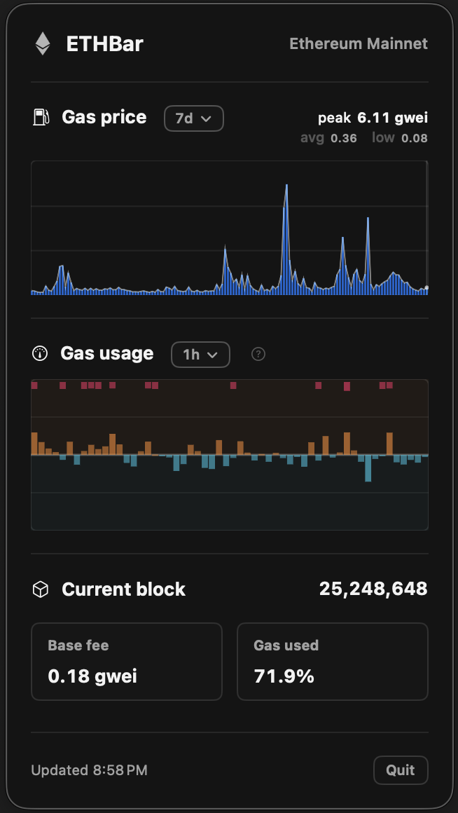

# ETHBar

ETHBar is a tiny macOS menu bar app for keeping Ethereum Mainnet in view.

It shows the live base fee in the menu bar, then opens into a compact popover with fee history, gas usage, the latest block, and last update time.



## What it does

- Live Ethereum Mainnet data
- Base fee history from `5m` to `7d`
- Gas usage history from `5m` to `7d`
- Current block, base fee, and gas used
- Local history cache for faster startup

## Under the hood

ETHBar uses PublicNode for HTTP and WebSocket access, subscribes to `newHeads`, backfills recent fee history, and keeps about seven days of data cached locally.

## How it works

```text
ETHBarApp
  creates
EthereumMetricsStore
  loads cached history
  backfills recent history over HTTP
  subscribes to live blocks over WebSocket
PublicNodeMetricsProvider
  uses
EthereumHTTPRPCClient + SubscriptionClient
  publishes
EthereumMetrics + ChainMetricHistory
  observed by
ContentView + chart views
```

1. `ETHBarApp` creates a shared `EthereumMetricsStore`.
2. The store loads cached history, then backfills missing data with `eth_feeHistory`.
3. Live updates come from a WebSocket `newHeads` subscription.
4. New block headers are normalized into app metrics and appended to local history.
5. SwiftUI updates the menu bar title and popover from the store's published state.

## Architecture

```text
ETHBar/
  ETHBar/
    ETHBarApp.swift                     // Menu bar entry point
    ContentView.swift                   // Main popover layout
    BaseFeeHistoryView.swift            // Base fee chart
    GasUsageHistoryView.swift           // Gas usage chart
    Models/                             // Shared data types
    Networking/
      EthereumHTTPRPCClient.swift       // HTTP JSON-RPC for block number and fee history
      SubscriptionClient.swift          // WebSocket newHeads subscription
    Providers/
      PublicNodeMetricsProvider.swift   // Mainnet data source via PublicNode
    Stores/
      EthereumMetricsStore.swift        // Runtime state, loading, and history sync
      ChainMetricHistoryCache.swift     // Local history persistence
    Support/                            // Logging and small helpers
  ETHBar.xcodeproj/                     // Xcode project
public/                                 // README assets
```

## Run it (I still need to set up a proper release build)
- macOS 14+
- Open `ETHBar/ETHBar.xcodeproj` in Xcode
- Build and run the `ETHBar` target

